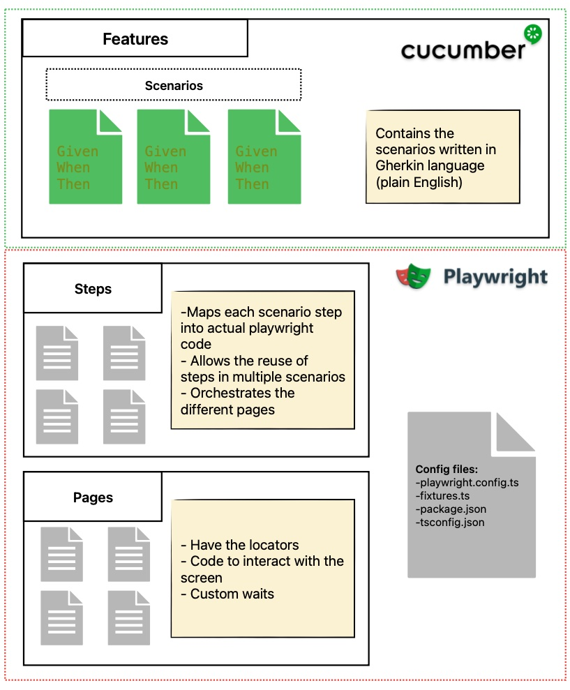

# playwright_demo
Project showcasing the main features of playwright

# Architecture




# Installation
```bash
#Install dependencies
npm install .
#Install playwright
npx playwright install
#generate the tests based on the feature files
npx bddgen
```

### Running the tests on a specific browser (by default they are executed in parallel)
```bash
npx playwright test --project chromium
```


### Filtering by tags
```bash
npx playwright test -g @smoke --project chromium
```

### Running tests in debug mode
```bash
npx playwright test --debug --project 'chromium' -g @customize
```

### Different browsers
```bash
npx playwright test --project webkit -g @smoke
```

### Emulate devices browsers
```bash
npx playwright test --project 'Mobile Safari' -g @smoke
npx playwright test --project 'Mobile Android' -g @smoke
```

### Additional reporters
#### HTML Report
```bash
export PLAYWRIGHT_HTML_OPEN=always
npx playwright test --project 'chromium' -g @vehicle_navigation --reporter=html
```
#### JUnit report
```bash
export PLAYWRIGHT_JUNIT_OUTPUT_NAME=results.xml
npx playwright test --project 'chromium' -g @smoke --reporter=junit
```

### Enable trace
```bash
export PLAYWRIGHT_HTML_OPEN=always
npx playwright test --project 'chromium' -g @smoke --reporter=html --trace on
```

### Running the test using the Playwright UI
```bash
npx playwright test --ui
```
