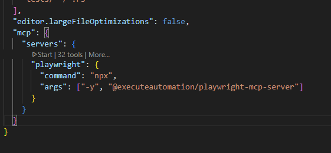

# playwright_demo
Project showcasing the main features of playwright

# Architecture


# Installation
```bash
#Install dependencies
npm install .
#Install playwright
npx playwright install
#generate the tests based on the feature files
npx bddgen
```

# Initial setup
Create a file named `.env` on the root of the repo and define the variable "BASE_URL" to the base url for the application you want to test
```bash
BASE_URL=<URL_FOR_HOME_PAGE>
```

### Running the tests on a specific browser (by default they are executed in parallel)
```bash
npx playwright test --project chromium
```

### Running specific feature
```bash
$env:FEATURE="Playwright/features/name_of_feature.feature"; npm run test:feature
```

### Filtering by tags
```bash
npx playwright test -g @smoke --project chromium
```

### Running tests in debug mode
```bash
npx playwright test --debug --project 'chromium' -g @customize
```

### Different browsers
```bash
npx playwright test --project webkit -g @smoke
```

### Emulate devices browsers
```bash
npx playwright test --project 'Mobile Safari' -g @smoke
npx playwright test --project 'Mobile Android' -g @smoke
```

### Additional reporters
#### HTML Report
```bash
export PLAYWRIGHT_HTML_OPEN=always
npx playwright test --project 'chromium' -g @vehicle_navigation --reporter=html
```
#### JUnit report
```bash
export PLAYWRIGHT_JUNIT_OUTPUT_NAME=results.xml
npx playwright test --project 'chromium' -g @smoke --reporter=junit
```

### Enable trace
```bash
export PLAYWRIGHT_HTML_OPEN=always
npx playwright test --project 'chromium' -g @smoke --reporter=html --trace on
```

### Running the test using the Playwright UI
```bash
npx playwright test --ui
```

## Installing GitHub Copilot in Visual Studio Code

1. **Open Visual Studio Code.**

2. **Go to the Extensions view:**
   - Click the Extensions icon on the Activity Bar on the side of VS Code  
     

3. **Search for "GitHub Copilot":**
   - In the Extensions search bar, type `GitHub Copilot`  
     

4. **Install the extension:**
   - Click on the "GitHub Copilot" extension from GitHub and then click the **Install** button  
     

5. **Sign in with your GitHub account if prompted.**

### Installing GitHub Copilot Chat

1. **Go to the Extensions view in Visual Studio Code.**
2. **Search for "GitHub Copilot Chat":**
   - In the Extensions search bar, type `GitHub Copilot Chat`.
3. **Install the extension:**
   - Click on the "GitHub Copilot Chat" extension from GitHub and then click the **Install** button.
   - 
4. **Sign in with your GitHub account if prompted.**

## Playwright MCP Installation and Setup

1. **Install Playwright MCP Server as a dev dependency:**
   ```bash
   npm install --save-dev @executeautomation/playwright-mcp-server
   ```

2. **Configure MCP in your VS Code settings:**
   - Open (or create) `.vscode/settings.json` or your global `settings.json`.
   - Add the following configuration:
     ```jsonc
     "mcp": {
       "servers": {
         "playwright": {
           "command": "npx",
           "args": ["-y", "@executeautomation/playwright-mcp-server"]
         }
       }
     }
     ```
   - Example (VS Code settings):
     
   - In this project, this is already set in your global/user `settings.json`.

3. **Start the MCP server (if not started automatically by your tools):**
   ```bash
   npx @executeautomation/playwright-mcp-server
   ```
   - Or, simply use the MCP features in VS Code and the extension will start the server as needed.

4. **Usage:**
   - Once installed and configured, you can use Playwright MCP features (such as site navigation, DOM inspection, and code generation) directly from your VS Code environment.
